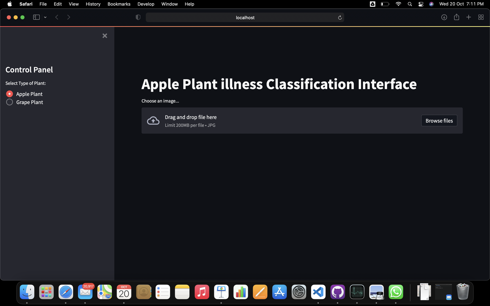

# Plant-disease-classification
 This is the code for the implementation of the AI based plant disease classification web application. The whole application is completely built in python. This app is completely compatible with any device. 
 The app lets you take the images from your directory or click new images on your camera if you are using a phone.

 ## The screen shots of the app are followes

